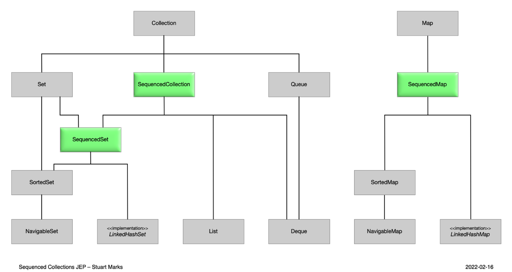

## Novidades Java 21

https://giulianabezerra.notion.site/Novidades-do-Java-21-5cada07ed581481fa1b14b78751f3c06

> **Sequenced Collections**

Você já precisou acessar o último elemento de uma lista? Ou reverter seus elementos? Ou mesmo remover o primeiro ou último? Algumas operações poderiam ser bem verbosas de implementar para algumas estruturas de lista e mapas. Um exemplo clássico é o código necessário para acessar o último elemento de um array list. Dá uma olhada no antes e depois pra entender os benefícios dessa nova API:

```
// Antes - Java 17
arrayList.get( arrayList.size() - 1 );
```

```
// Depois - Java 21
arrayList.getLast();
```

Pra termos essa nova API, as novas interfaces sequenciais passaram a implementar as famosas classes Collection e Map, que herdaram todas essas operações que permitem o acesso sequencial ou reverso aos elementos de uma coleção.



Esse exemplo mostra as principais operações que foram trazidas por essa nova API e que agora podem ser usadas nos códigos com Java 21.

```
interface SequencedCollection<E> extends Collection<E> {
    SequencedCollection<E> reversed();
    void addFirst(E);
    void addLast(E);
    E getFirst();
    E getLast();
    E removeFirst();
    E removeLast();
}
```

> **Record Patterns**

Os records foram introduzidos no Java 14 e trazem a ideia de objetos imutáveis e compactos, sem todo aquele boilerplate que usamos normalmente para criar POJOs. Se a gente precisasse desestruturar um record tínhamos que obter cada uma das suas propriedades, o que tornava o código bem verboso. Com o Record Patterns ficou beeem mais simples, dá só uma olhada:

```
// Antes - Java 17
if (obj instanceof User user) {
    var username = user.username();
    var password = user.password();
    var email = user.email();
    System.out.printf("%s, %s, %s%n", username, password, email);
}
```

```
// Depois - Java 21
if (obj instanceof User(String username, String password, String email)) {
    System.out.printf("%s, %s, %s", username, password, email);
}
```

> **Pattern Matching for Switch**

A desestruturação mostrada na funcionalidade anterior agora também pode ser usada dentro de um switch, o que também reduz bastante a verbosidade do código:

```
// Antes - Java 17
switch (obj) {
    case User user -> System.out.printf("%s, %s, %s%n",
    user.username(), user.password(), user.email());
    default -> System.out.println("??");
}
```

```
// Depois - Java 21
switch (obj) {
    case User(String username, String password, String email) ->
    System.out.printf("%s, %s, %s%n", username, password, email);
    default -> System.out.println("??");
}
```

> **Virtual Threads**

> Essa é talvez a funcionalidade mais comentada. É basicamente uma forma de criar threads com um custo menor sem a limitação do número de threads da máquina, já que as threads são gerenciadas pela JVM!

```
// Thread API
Thread.startVirtualThread(
() -> System.out.println("Virtual Thread w/ Thread API"));
```

```
// Executors API
var executor = Executors.newVirtualThreadPerTaskExecutor();
executor.submit(() -> System.out.println("Virtual Thread w/ Executors API"));
```
https://www.oracle.com/br/news/announcement/ocw-oracle-releases-java-21-2023-09-19/

## Oracle lança o Java 21 e amplia o roteiro de suporte

