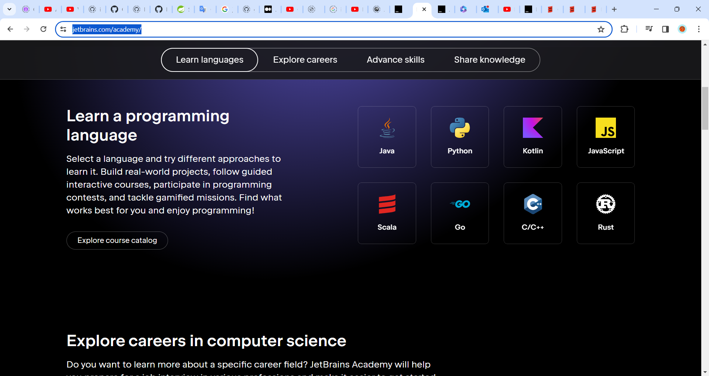
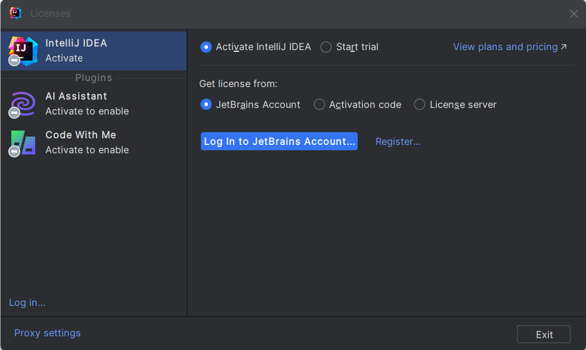

## Instalação e configuração do ambiente JAVA

### Versões disponíveis do Java

> https://code.visualstudio.com/docs/languages/java

- [OpenJDK](https://jdk.java.net/21/)
- [Amazon Corretto](https://aws.amazon.com/corretto/?filtered-posts.sort-by=item.additionalFields.createdDate&filtered-posts.sort-order=desc)
- [Azul Zulu](https://www.azul.com/downloads/?package=jdk#zulu)
- [Eclipse Adoptium's Temurin](https://adoptium.net/)
- [IBM Semeru Runtimes](https://developer.ibm.com/languages/java/semeru-runtimes/downloads/?os=Windows)
- [Microsoft Build of OpenJDK](https://www.microsoft.com/openjdk)
- [Oracle Java SE](https://www.oracle.com/java/technologies/downloads/)
- [Red Hat build of OpenJDK](https://developers.redhat.com/products/openjdk/download)
- [SapMachine](https://sap.github.io/SapMachine/)

### Windows

> Instalação

> > Java Oracle 1.8

```sh
❯ java -version
java version "1.8.0_391"
Java(TM) SE Runtime Environment (build 1.8.0_391-b13)
Java HotSpot(TM) 64-Bit Server VM (build 25.391-b13, mixed mode)
```

> > Java 11.016.1

```sh
❯ java -version
openjdk version "11.0.16.1" 2022-08-12 LTS
OpenJDK Runtime Environment Microsoft-40648 (build 11.0.16.1+1-LTS)
OpenJDK 64-Bit Server VM Microsoft-40648 (build 11.0.16.1+1-LTS, mixed mode)
```

> > Instalação da versão 21


```sh
❯ java -version
openjdk version "21.0.1" 2023-10-17 LTS
OpenJDK Runtime Environment Temurin-21.0.1+12 (build 21.0.1+12-LTS)
OpenJDK 64-Bit Server VM Temurin-21.0.1+12 (build 21.0.1+12-LTS, mixed mode, sharing)
```


---

## `##############################################################`

### WSL Ubuntu

```sh
➜  ~ sudo apt update
[sudo] password for lesp:
Get:1 http://security.ubuntu.com/ubuntu jammy-security InRelease [110 kB]
Hit:2 http://archive.ubuntu.com/ubuntu jammy InRelease
Get:3 http://archive.ubuntu.com/ubuntu jammy-updates InRelease [119 kB]
Get:4 http://security.ubuntu.com/ubuntu jammy-security/main amd64 Packages [1062 kB]
Hit:5 http://archive.ubuntu.com/ubuntu jammy-backports InRelease
Get:6 http://archive.ubuntu.com/ubuntu jammy-updates/main amd64 Packages [1277 kB]
Get:7 http://security.ubuntu.com/ubuntu jammy-security/universe amd64 Packages [826 kB]
Get:8 http://archive.ubuntu.com/ubuntu jammy-updates/universe amd64 Packages [1023 kB]
Fetched 4417 kB in 2s (1983 kB/s)
Reading package lists... Done
Building dependency tree... Done
Reading state information... Done
14 packages can be upgraded. Run 'apt list --upgradable' to see them.
```

> Programas que precisam ser instalado anteriormente ao SDK Manager

```sh
➜  ~ curl
curl: try 'curl --help' or 'curl --manual' for more information
➜  ~ curl --version
curl 7.81.0 (x86_64-pc-linux-gnu) libcurl/7.81.0 OpenSSL/3.0.2 zlib/1.2.11 brotli/1.0.9 zstd/1.4.8 libidn2/2.3.2 libpsl/0.21.0 (+libidn2/2.3.2) libssh/0.9.6/openssl/zlib nghttp2/1.43.0 librtmp/2.3 OpenLDAP/2.5.16
Release-Date: 2022-01-05
Protocols: dict file ftp ftps gopher gophers http https imap imaps ldap ldaps mqtt pop3 pop3s rtmp rtsp scp sftp smb smbs smtp smtps telnet tftp
Features: alt-svc AsynchDNS brotli GSS-API HSTS HTTP2 HTTPS-proxy IDN IPv6 Kerberos Largefile libz NTLM NTLM_WB PSL SPNEGO SSL TLS-SRP UnixSockets zstd
```

```sh
➜  ~ sudo apt install unzip
Reading package lists... Done
Building dependency tree... Done
Reading state information... Done
unzip is already the newest version (6.0-26ubuntu3.1).
0 upgraded, 0 newly installed, 0 to remove and 14 not upgraded.
```

```sh
➜  ~ sudo apt install zip
[sudo] password for lesp:
Reading package lists... Done
Building dependency tree... Done
Reading state information... Done
zip is already the newest version (3.0-12build2).
0 upgraded, 0 newly installed, 0 to remove and 14 not upgraded.
```

`````````
➜  ~ curl -s "https://get.sdkman.io" | bash

                                -+syyyyyyys:
                            `/yho:`       -yd.
                         `/yh/`             +m.
                       .oho.                 hy                          .`
                     .sh/`                   :N`                `-/o`  `+dyyo:.
                   .yh:`                     `M-          `-/osysoym  :hs` `-+sys:      hhyssssssssy+
                 .sh:`                       `N:          ms/-``  yy.yh-      -hy.    `.N-````````+N.
               `od/`                         `N-       -/oM-      ddd+`     `sd:     hNNm        -N:
              :do`                           .M.       dMMM-     `ms.      /d+`     `NMMs       `do
            .yy-                             :N`    ```mMMM.      -      -hy.       /MMM:       yh
          `+d+`           `:/oo/`       `-/osyh/ossssssdNMM`           .sh:         yMMN`      /m.
         -dh-           :ymNMMMMy  `-/shmNm-`:N/-.``   `.sN            /N-         `NMMy      .m/
       `oNs`          -hysosmMMMMydmNmds+-.:ohm           :             sd`        :MMM/      yy
      .hN+           /d:    -MMMmhs/-.`   .MMMh   .ss+-                 `yy`       sMMN`     :N.
     :mN/           `N/     `o/-`         :MMMo   +MMMN-         .`      `ds       mMMh      do
    /NN/            `N+....--:/+oooosooo+:sMMM:   hMMMM:        `my       .m+     -MMM+     :N.
   /NMo              -+ooooo+/:-....`...:+hNMN.  `NMMMd`        .MM/       -m:    oMMN.     hs
  -NMd`                                    :mm   -MMMm- .s/     -MMm.       /m-   mMMd     -N.
 `mMM/                                      .-   /MMh. -dMo     -MMMy        od. .MMMs..---yh
 +MMM.                                           sNo`.sNMM+     :MMMM/        sh`+MMMNmNm+++-
 mMMM-                                           /--ohmMMM+     :MMMMm.       `hyymmmdddo
 MMMMh.                  ````                  `-+yy/`yMMM/     :MMMMMy       -sm:.``..-:-.`
 dMMMMmo-.``````..-:/osyhddddho.           `+shdh+.   hMMM:     :MmMMMM/   ./yy/` `:sys+/+sh/
 .dMMMMMMmdddddmmNMMMNNNNNMMMMMs           sNdo-      dMMM-  `-/yd/MMMMm-:sy+.   :hs-      /N`
  `/ymNNNNNNNmmdys+/::----/dMMm:          +m-         mMMM+ohmo/.` sMMMMdo-    .om:       `sh
     `.-----+/.`       `.-+hh/`         `od.          NMMNmds/     `mmy:`     +mMy      `:yy.
           /moyso+//+ossso:.           .yy`          `dy+:`         ..       :MMMN+---/oys:
         /+m:  `.-:::-`               /d+                                    +MMMMMMMNh:`
        +MN/                        -yh.                                     `+hddhy+.
       /MM+                       .sh:
      :NMo                      -sh/
     -NMs                    `/yy:
    .NMy                  `:sh+.
   `mMm`               ./yds-
  `dMMMmyo:-.````.-:oymNy:`
  +NMMMMMMMMMMMMMMMMms:`
    -+shmNMMMNmdy+:`


                                                                 Now attempting installation...


Looking for a previous installation of SDKMAN...
Looking for unzip...
Looking for zip...
Looking for curl...
Looking for sed...
Installing SDKMAN scripts...
Create distribution directories...
Getting available candidates...
Prime platform file...
Prime the config file...
Installing script cli archive...
* Downloading...
######################################################################## 100.0%
* Checking archive integrity...
* Extracting archive...
* Copying archive contents...
* Cleaning up...

Installing script cli archive...
* Downloading...
######################################################################## 100.0%
* Checking archive integrity...
* Extracting archive...
* Copying archive contents...
* Cleaning up...

Set version to 5.18.2 ...
Set native version to 0.4.6 ...
Attempt update of interactive bash profile on regular UNIX...
Added sdkman init snippet to /home/lesp/.bashrc
Attempt update of zsh profile...
Updated existing /home/lesp/.zshrc


All done!


You are subscribed to the STABLE channel.

Please open a new terminal, or run the following in the existing one:

    source "/home/lesp/.sdkman/bin/sdkman-init.sh"

Then issue the following command:

    sdk help

Enjoy!!!
`````````

```sh
➜  ~ sdk

NAME
    sdk - The command line interface (CLI) for SDKMAN!

SYNOPSIS
    sdk <subcommand> [candidate] [version]

DESCRIPTION
    SDKMAN! is a tool for managing parallel versions of multiple JVM related
    Software Development Kits on most Unix based systems. It provides a
    convenient Command Line Interface (CLI) and API for installing, switching,
    removing and listing Candidates.

SUBCOMMANDS & QUALIFIERS
    help         [subcommand]
    install      <candidate> [version] [path]
    uninstall    <candidate> <version>
    list         [candidate]
    use          <candidate> <version>
    config       no qualifier
    default      <candidate> [version]
    home         <candidate> <version>
    env          [init|install|clear]
    current      [candidate]
    upgrade      [candidate]
    version      no qualifier
    offline      [enable|disable]
    selfupdate   [force]
    update       no qualifier
    flush        [tmp|metadata|version]

EXAMPLES
    sdk install java 17.0.0-tem
    sdk help install
```

```sh
➜  ~ sdk list java

================================================================================
Available Java Versions for Linux 64bit
================================================================================
 Vendor        | Use | Version      | Dist    | Status     | Identifier
--------------------------------------------------------------------------------
 Corretto      |     | 21.0.1       | amzn    |            | 21.0.1-amzn
               |     | 17.0.9       | amzn    |            | 17.0.9-amzn
               |     | 11.0.21      | amzn    |            | 11.0.21-amzn
               |     | 8.0.392      | amzn    |            | 8.0.392-amzn
 Dragonwell    |     | 17.0.9       | albba   |            | 17.0.9-albba
               |     | 11.0.21      | albba   |            | 11.0.21-albba
               |     | 11.0.20      | albba   |            | 11.0.20-albba
               |     | 8.0.392      | albba   |            | 8.0.392-albba
               |     | 8.0.382      | albba   |            | 8.0.382-albba
 Gluon         |     | 22.1.0.1.r17 | gln     |            | 22.1.0.1.r17-gln
               |     | 22.1.0.1.r11 | gln     |            | 22.1.0.1.r11-gln
 GraalVM CE    |     | 21.0.1       | graalce |            | 21.0.1-graalce
               |     | 17.0.9       | graalce |            | 17.0.9-graalce
 GraalVM Oracle|     | 21.0.1       | graal   |            | 21.0.1-graal
               |     | 17.0.9       | graal   |            | 17.0.9-graal
 Java.net      |     | 23.ea.5      | open    |            | 23.ea.5-open
               |     | 23.ea.4      | open    |            | 23.ea.4-open
               |     | 23.ea.3      | open    |            | 23.ea.3-open
               |     | 23.ea.2      | open    |            | 23.ea.2-open
               |     | 23.ea.1      | open    |            | 23.ea.1-open
               |     | 22.ea.31     | open    |            | 22.ea.31-open
               |     | 22.ea.30     | open    |            | 22.ea.30-open
               |     | 22.ea.29     | open    |            | 22.ea.29-open
               |     | 22.ea.28     | open    |            | 22.ea.28-open
               |     | 22.ea.27     | open    |            | 22.ea.27-open
               |     | 22.ea.26     | open    |            | 22.ea.26-open
               |     | 21.ea.35     | open    |            | 21.ea.35-open
 JetBrains     |     | 17.0.9       | jbr     |            | 17.0.9-jbr
               |     | 11.0.14.1    | jbr     |            | 11.0.14.1-jbr
```

> digitar `q` para sair do modo interativo

> Escolhida a versão para a instalação digitar `sdk install java <identifier>`

```sh
➜  ~ sdk install java 21.ea.35-open

Downloading: java 21.ea.35-open

In progress...

######################################################################################################################################### 100.0%

Repackaging Java 21.ea.35-open...

Done repackaging...

Installing: java 21.ea.35-open
Done installing!


Setting java 21.ea.35-open as default.
```

```sh
➜  ~ java -version
openjdk version "21" 2023-09-19
OpenJDK Runtime Environment (build 21+35-2513)
OpenJDK 64-Bit Server VM (build 21+35-2513, mixed mode, sharing)
```

> Instalação de outra distribuição java

```sh
➜  ~ sdk install java 17.0.9-jbr

Downloading: java 17.0.9-jbr

In progress...

######################################################################################################################################### 100.0%######################################################################################################################################### 100.0%

Repackaging Java 17.0.9-jbr...

Done repackaging...

Installing: java 17.0.9-jbr
Done installing!

Do you want java 17.0.9-jbr to be set as default? (Y/n): y

Setting java 17.0.9-jbr as default.
```

```sh
➜  ~ java -version
openjdk version "17.0.9" 2023-10-17
OpenJDK Runtime Environment JBR-17.0.9+7-1087.3-nomod (build 17.0.9+7-b1087.3)
OpenJDK 64-Bit Server VM JBR-17.0.9+7-1087.3-nomod (build 17.0.9+7-b1087.3, mixed mode)
```

> modificar a versão do Java

```sh
skd use java <identifier>
```


```sh
➜  ~ java -version
openjdk version "17.0.9" 2023-10-17
OpenJDK Runtime Environment JBR-17.0.9+7-1087.3-nomod (build 17.0.9+7-b1087.3)
OpenJDK 64-Bit Server VM JBR-17.0.9+7-1087.3-nomod (build 17.0.9+7-b1087.3, mixed mode)
```

```sh
➜  ~ sdk use java
```

```sh
➜  ~ sdk use java 21.ea.35-open

Using java version 21.ea.35-open in this shell
```

### Ubuntu

```sh

```

### IDE

> **Intelij**

https://www.jetbrains.com/community/education/#students

https://www.jetbrains.com/academy/

https://www.jetbrains.com/idea/








> **Eclipse**

https://spring.io/tools/

> **VSCode**

https://code.visualstudio.com/download

> > Tutorial:

https://code.visualstudio.com/docs/languages/java

>> Extensões para utilizar o Java com o Spring


